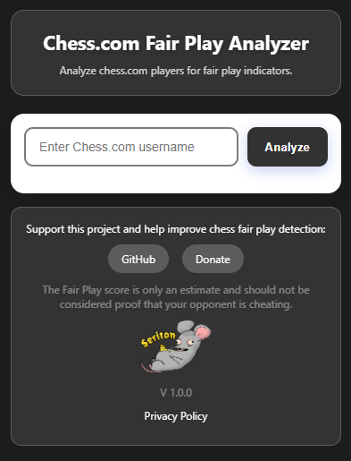
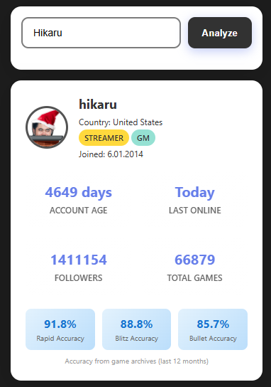
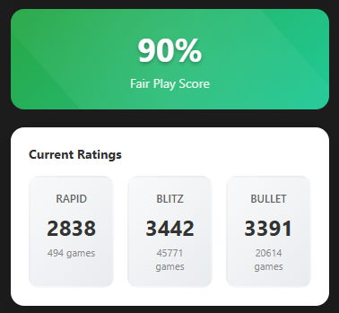

# <p align="center">Chess.com Fair Play Analyzer</p>

Analyze chess.com players for fair play indicators.

<p align="center"></p>

[](CHANGELOG.md)


[](PRIVACY_POLICY.md)
[](LICENSE)

<table>
  <tr>
    <th>#</th>
    <th>Feature</th>
  </tr>
  <tr>
    <td>1</td>
    <td>Analysis of a selected Chess.com user's data</td>
  </tr>
  <tr>
    <td>2</td>
    <td>Player profile and account information</td>
  </tr>
  <tr>
    <td>3</td>
    <td>Rapid, Blitz and Bullet rating analysis</td>
  </tr>
  <tr>
    <td>4</td>
    <td>Game count and win-rate analysis</td>
  </tr>
  <tr>
    <td>5</td>
    <td>Average accuracy analysis for Rapid, Blitz and Bullet</td>
  </tr>
  <tr>
    <td>6</td>
    <td>Rating history analysis</td>
  </tr>
  <tr>
    <td>7</td>
    <td>Win-rate visualization</td>
  </tr>
  <tr>
    <td>8</td>
    <td>Rating progression charts</td>
  </tr>
  <tr>
    <td>9</td>
    <td>Fair Play score based on multiple statistical indicators</td>
  </tr>
  <tr>
    <td>10</td>
    <td>Analysis progress and error handling</td>
  </tr>
</table>

## Installation

### 1. Download the extension from the Chrome Web Store:

```bash
https://chromewebstore.google.com/detail/oobncfbkabmfhdplldpndkediijlkhpg?utm_source=item-share-cb
```
### OR

### 2. Download the repository as a ZIP file:

2.1 Download Repository (ZIP) ;<br>
2.2 Extract the repository ;<br>
2.3 Open the browser extensions page ;<br>
2.4 Enable "Developer Mode" on the extensions management page ;<br>
2.5 Click "Load unpacked" and select the root folder of this repository.

## Usage

1. Open the extension ;

2. Enter the username you want to analyze in the text box, then click the “Analyze” button to start the analysis ;

3. After completing the steps above, the user’s Fair Play score should be displayed.


## How It Works

The extension analyzes a Chess.com player based on publicly available profile, rating and game history. It combines several statistical indicators to generate a "Fair Play Score" and provide a quick overview of the player's activity.<br>


## Limitations

The accuracy of the analysis depends on the quality and amount of available game and player data.<br>
Statistical analysis alone cannot determine with certainty whether a player used computer assistance.

## Important Notice

The "Fair Play Score" is a statistical indicator developed by this extension, not an official verdict of cheating. A low score does not mean that a player is definitely cheating, and a high score does not prove that a player is definitely playing fairly. The score should be treated as an additional analytical indicator, not as definitive proof of cheating.

<p align="center"></p>
